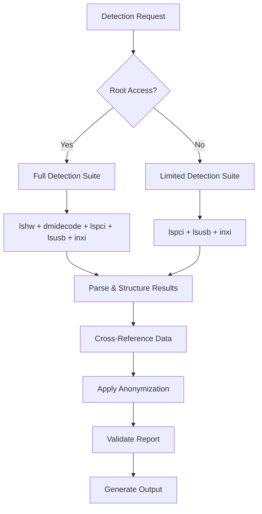

# System Architecture

A comprehensive technical overview of the Linux Hardware Compatibility Database architecture, design patterns, and implementation details.

## 🏗️ Architectural Overview

The lx-hw-db system follows a **federated, privacy-first architecture** designed to scale from individual users to enterprise deployments while maintaining strong privacy guarantees and community governance.

### Core Architectural Principles

1. **Privacy by Design**: Privacy protection implemented at every architectural layer
2. **Git-Native Storage**: Leverages Git's distributed nature for scalability and resilience  
3. **Static-First Web**: Performance-optimized static file delivery with dynamic capabilities
4. **Modular Components**: Loosely coupled components enabling independent development
5. **Community Governance**: Architecture supports transparent community decision-making

### System Context Diagram

```
┌─────────────────────────────────────────────────────────────────────────────┐
│                           External Systems                                  │
│  ┌─────────────┐  ┌─────────────────┐  ┌─────────────────┐  ┌─────────────┐ │
│  │   Linux     │  │    Hardware     │  │     GitHub      │  │   Content   │ │
│  │   Kernel    │  │    Vendors      │  │  Infrastructure │  │ Distribution│ │
│  │   Sources   │  │      APIs       │  │     (CI/CD)     │  │  Networks   │ │
│  └─────────────┘  └─────────────────┘  └─────────────────┘  └─────────────┘ │
│         │                  │                     │                  │       │
└─────────┼──────────────────┼─────────────────────┼──────────────────┼───────┘
          │                  │                     │                  │
┌─────────┼──────────────────┼─────────────────────┼──────────────────┼───────┐
│         │                  │                     │                  │       │
│  ┌──────▼─────┐    ┌───────▼────┐       ┌────────▼───────┐  ┌──────▼─────┐ │
│  │ Detection  │    │ Community  │       │   Web Interface│  │  CLI Tools │ │
│  │  Engines   │◄──►│   Data     │◄─────►│   & APIs      │  │ & GUI Apps │ │
│  │            │    │Repository  │       │               │  │            │ │
│  └────────────┘    └────────────┘       └───────────────┘  └────────────┘ │
│         │                  │                     │                  │       │
│  ┌──────▼─────┐    ┌───────▼────┐       ┌────────▼───────┐  ┌──────▼─────┐ │
│  │ Privacy &  │    │ Search &   │       │  Statistics &  │  │Configuration│ │
│  │Anonymization│    │ Indexing  │       │   Analytics   │  │ Generation │ │
│  │            │    │  System    │       │               │  │            │ │
│  └────────────┘    └────────────┘       └───────────────┘  └────────────┘ │
│                                lx-hw-db Core System                        │
└─────────────────────────────────────────────────────────────────────────────┘
```

---

## 🎯 Component Architecture

### Hardware Detection Layer

The detection layer implements a **plugin-based architecture** supporting multiple hardware detection tools with unified output formatting.

#### Detection Engine Design

```rust
// Core detection abstraction
pub trait Detector: Send + Sync {
    fn name(&self) -> &str;
    fn priority(&self) -> u8;
    fn supported_platforms(&self) -> &[Platform];
    fn detect(&self, config: &DetectionConfig) -> Result<DetectionResult, DetectorError>;
    fn validate_environment(&self) -> Result<(), EnvironmentError>;
}

// Composite detector orchestrating multiple detection tools
pub struct HardwareDetectionEngine {
    detectors: Vec<Box<dyn Detector>>,
    anonymizer: Arc<Anonymizer>,
    validator: Arc<ResultValidator>,
}

impl HardwareDetectionEngine {
    pub async fn detect_all(&self) -> Result<SystemReport, DetectionError> {
        // Parallel execution of detectors
        let detection_futures: Vec<_> = self.detectors
            .iter()
            .map(|detector| self.run_detector_with_timeout(detector))
            .collect();
        
        let results = futures::join_all(detection_futures).await;
        
        // Merge results with conflict resolution
        let merged_report = self.merge_detection_results(results)?;
        
        // Apply privacy anonymization
        let anonymized_report = self.anonymizer.anonymize_report(merged_report)?;
        
        // Validate final result
        self.validator.validate_report(&anonymized_report)?;
        
        Ok(anonymized_report)
    }
}
```

#### Supported Detection Tools

**Tool Comparison Matrix:**

| Tool | Coverage | Speed | Privileges | Output Format | Kernel Compat |
|------|----------|--------|------------|---------------|---------------|
| **lshw** | ★★★★★ | ★★★☆☆ | Root preferred | JSON/XML | All |
| **dmidecode** | ★★★☆☆ | ★★★★★ | Root required | Text | All |
| **lspci** | ★★★★☆ | ★★★★★ | User OK | Text | All |
| **lsusb** | ★★★☆☆ | ★★★★★ | User OK | Text | All |
| **inxi** | ★★★★☆ | ★★★☆☆ | User OK | Text/JSON | All |

**Detection Flow:**



#### Hardware Component Models

```rust
#[derive(Debug, Clone, Serialize, Deserialize)]
pub struct HardwareDevice {
    pub device_id: String,           // Anonymized device identifier
    pub vendor_id: String,           // Anonymized vendor identifier
    pub component_type: ComponentType,
    pub specifications: DeviceSpecs,
    pub compatibility: CompatibilityInfo,
    pub detection_metadata: DetectionMetadata,
}

#[derive(Debug, Clone, Serialize, Deserialize)]
pub struct CompatibilityInfo {
    pub status: CompatibilityStatus,  // Excellent, Good, Fair, Poor, Critical
    pub score: f64,                  // 0.0 - 100.0
    pub kernel_support: KernelSupport,
    pub driver_info: DriverInfo,
    pub known_issues: Vec<KnownIssue>,
    pub workarounds: Vec<Workaround>,
}

#[derive(Debug, Clone, Serialize, Deserialize)]
pub struct KernelSupport {
    pub minimum_version: Option<String>,
    pub optimal_version: Option<String>,
    pub modules: Vec<String>,
    pub built_in_support: bool,
    pub firmware_required: Vec<String>,
}
```

### Privacy and Anonymization Layer

**Privacy-First Architecture** implementing multiple layers of protection:

#### Anonymization Pipeline

```rust
pub struct AnonymizationPipeline {
    stages: Vec<Box<dyn AnonymizationStage>>,
}

// Multi-stage anonymization process
pub trait AnonymizationStage {
    fn name(&self) -> &str;
    fn process(&self, data: &mut SystemReport, context: &AnonymizationContext) -> Result<(), PrivacyError>;
}

// Stage 1: Hardware ID anonymization
pub struct HardwareIdAnonymizer {
    hasher: HmacSha256,
    salt_manager: SaltManager,
}

impl AnonymizationStage for HardwareIdAnonymizer {
    fn process(&self, report: &mut SystemReport, context: &AnonymizationContext) -> Result<(), PrivacyError> {
        for device in &mut report.devices {
            // Apply HMAC-SHA256 with time-rotating salts
            device.device_id = self.anonymize_device_id(&device.device_id, context)?;
            device.vendor_id = self.anonymize_vendor_id(&device.vendor_id, context)?;
            
            // Remove or hash serial numbers
            if let Some(serial) = &device.serial_number {
                device.serial_number = Some(self.hash_serial(serial, context)?);
            }
        }
        Ok(())
    }
}

// Stage 2: System information generalization
pub struct SystemInfoGeneralizer {
    generalization_rules: GeneralizationRules,
}

// Stage 3: Differential privacy noise injection
pub struct DifferentialPrivacyStage {
    epsilon: f64,  // Privacy budget
    noise_generator: LaplaceNoiseGenerator,
}

// Stage 4: K-anonymity enforcement
pub struct KAnonymityEnforcer {
    k: usize,  // Minimum group size
    database: Arc<CompatibilityDatabase>,
}
```

#### Privacy Configuration

**Privacy Levels:**

```toml
# Privacy configuration schema
[privacy.basic]
hardware_id_hashing = true
system_info_generalization = "minimal"
differential_privacy = false
k_anonymity_k = 3
salt_rotation_hours = 24

[privacy.enhanced]  
hardware_id_hashing = true
system_info_generalization = "moderate"
differential_privacy = true
differential_privacy_epsilon = 1.0
k_anonymity_k = 5
salt_rotation_hours = 12
timestamp_rounding_minutes = 60

[privacy.strict]
hardware_id_hashing = true
system_info_generalization = "aggressive"
differential_privacy = true
differential_privacy_epsilon = 0.5
k_anonymity_k = 10
salt_rotation_hours = 6
timestamp_rounding_minutes = 120
suppress_rare_hardware = true
```

### Data Storage and Management

#### Git-Native Database Design

**Repository Structure:**
```
lx-hw-db-data/
├── hardware-reports/           # Raw anonymized hardware reports
│   └── YYYY/MM/               # Organized by submission date
│       ├── report-001.yaml
│       ├── report-002.yaml
│       └── ...
├── indices/                   # Generated search indices
│   ├── by-vendor.json
│   ├── by-component.json
│   ├── by-kernel.json
│   ├── compatibility-matrix.json
│   └── search-terms.json
├── statistics/                # Aggregated statistics
│   ├── overview.json
│   ├── trends.json
│   └── hardware-rankings.json
├── api/                       # API endpoint data
│   └── v1/
│       ├── search/
│       ├── stats/
│       └── recommendations/
└── schemas/                   # Data validation schemas
    ├── hardware-report.schema.json
    ├── compatibility.schema.json
    └── api-response.schema.json
```

#### Database Processing Pipeline

```rust
pub struct DataPipeline {
    stages: Vec<Box<dyn PipelineStage>>,
}

pub trait PipelineStage {
    fn name(&self) -> &str;
    fn process(&self, context: &PipelineContext) -> Result<(), PipelineError>;
    fn dependencies(&self) -> Vec<&str>;
}

// Pipeline stages for data processing
pub struct ValidationStage;          // Validate incoming reports
pub struct IndexingStage;            // Build search indices  
pub struct StatisticsStage;          // Generate aggregate statistics
pub struct ApiGenerationStage;       // Generate API endpoint data
pub struct CompatibilityAnalysisStage;  // Analyze compatibility patterns
```

**Index Generation Architecture:**

```rust
// Search index builder supporting multiple query types
pub struct SearchIndexBuilder {
    indices: HashMap<String, Box<dyn SearchIndex>>,
}

pub trait SearchIndex {
    fn name(&self) -> &str;
    fn build(&self, reports: &[HardwareReport]) -> Result<IndexData, IndexError>;
    fn query_types(&self) -> &[QueryType];
}

// Vendor-based index for vendor compatibility queries
pub struct VendorIndex {
    vendor_map: HashMap<String, VendorData>,
}

impl SearchIndex for VendorIndex {
    fn build(&self, reports: &[HardwareReport]) -> Result<IndexData, IndexError> {
        let mut vendor_data = HashMap::new();
        
        for report in reports {
            for device in &report.devices {
                let vendor_entry = vendor_data
                    .entry(device.vendor_id.clone())
                    .or_insert_with(|| VendorData::new(&device.vendor_id));
                
                vendor_entry.add_device_report(device, &report.metadata);
            }
        }
        
        Ok(IndexData::Vendor(vendor_data))
    }
}
```

---

## 🌐 Web Architecture

### Static-First Architecture

The web interface follows a **static-first architecture** optimized for performance, security, and CDN distribution.

#### Client-Side Architecture

```javascript
// Modular JavaScript architecture
class HardwareDatabase {
    constructor(apiBaseUrl) {
        this.api = new APIClient(apiBaseUrl);
        this.search = new SearchEngine();
        this.cache = new DataCache();
        this.ui = new UIManager();
    }
    
    async initialize() {
        // Load core data indices
        await this.cache.preload([
            '/api/v1/search/vendors.json',
            '/api/v1/search/components.json',
            '/api/v1/stats/overview.json'
        ]);
        
        // Initialize search engine
        this.search.buildIndices(this.cache.getData());
        
        // Setup UI components
        this.ui.initialize();
    }
}

// Distributed search engine using FlexSearch
class SearchEngine {
    constructor() {
        this.indices = new Map();
        this.flexSearch = new FlexSearch.Document({
            document: {
                id: 'device_id',
                index: ['vendor', 'model', 'component_type', 'compatibility_notes'],
                store: true
            }
        });
    }
    
    buildIndices(data) {
        // Build multiple search indices for different query types
        this.indices.set('vendor', this.buildVendorIndex(data.vendors));
        this.indices.set('component', this.buildComponentIndex(data.components));
        this.indices.set('compatibility', this.buildCompatibilityIndex(data.compatibility));
        
        // Build FlexSearch full-text index
        data.hardware.forEach(device => this.flexSearch.add(device));
    }
}
```

#### Performance Optimization

**Lazy Loading Strategy:**
```javascript
// Progressive data loading based on user interaction
class DataLoader {
    constructor() {
        this.loadedSections = new Set();
        this.loadingPromises = new Map();
    }
    
    async loadSection(section) {
        if (this.loadedSections.has(section)) {
            return this.cache.getSection(section);
        }
        
        if (this.loadingPromises.has(section)) {
            return this.loadingPromises.get(section);
        }
        
        const loadPromise = this.fetchSectionData(section);
        this.loadingPromises.set(section, loadPromise);
        
        try {
            const data = await loadPromise;
            this.loadedSections.add(section);
            this.cache.setSection(section, data);
            return data;
        } finally {
            this.loadingPromises.delete(section);
        }
    }
}
```

**Caching Strategy:**
```javascript
// Multi-level caching with intelligent invalidation
class CacheManager {
    constructor() {
        this.memoryCache = new Map();
        this.browserCache = new BrowserStorage('lx-hw-db');
        this.networkCache = new ServiceWorkerCache();
    }
    
    async get(key, maxAge = 300000) { // 5 minutes default
        // L1: Memory cache
        const memCached = this.memoryCache.get(key);
        if (memCached && Date.now() - memCached.timestamp < maxAge) {
            return memCached.data;
        }
        
        // L2: Browser storage
        const browserCached = await this.browserCache.get(key);
        if (browserCached && Date.now() - browserCached.timestamp < maxAge) {
            this.memoryCache.set(key, browserCached);
            return browserCached.data;
        }
        
        // L3: Network with Service Worker cache
        const networkData = await this.networkCache.fetch(key);
        
        // Store in all cache levels
        const cacheEntry = { data: networkData, timestamp: Date.now() };
        this.memoryCache.set(key, cacheEntry);
        await this.browserCache.set(key, cacheEntry);
        
        return networkData;
    }
}
```

### API Layer Architecture

#### Static API Generation

```rust
pub struct ApiGenerator {
    output_dir: PathBuf,
    generators: Vec<Box<dyn EndpointGenerator>>,
}

pub trait EndpointGenerator {
    fn endpoint_path(&self) -> &str;
    fn generate(&self, data: &DatabaseSnapshot) -> Result<serde_json::Value, ApiError>;
    fn cache_headers(&self) -> CacheHeaders;
    fn dependencies(&self) -> Vec<&str>;
}

// Generate vendor search endpoint
pub struct VendorEndpointGenerator;

impl EndpointGenerator for VendorEndpointGenerator {
    fn generate(&self, data: &DatabaseSnapshot) -> Result<serde_json::Value, ApiError> {
        let vendor_data: Vec<_> = data.vendors
            .iter()
            .map(|(id, vendor)| json!({
                "vendor": id,
                "vendor_name": vendor.name,
                "total_reports": vendor.report_count,
                "compatibility_score": vendor.avg_compatibility_score,
                "component_types": vendor.component_types,
                "supported_kernels": vendor.supported_kernels,
                "market_share": vendor.market_share_percent,
                "trend": vendor.trend_direction
            }))
            .collect();
        
        Ok(json!({
            "version": "1.0",
            "generated": chrono::Utc::now(),
            "data": vendor_data,
            "metadata": {
                "total_vendors": vendor_data.len(),
                "last_updated": data.last_updated
            }
        }))
    }
    
    fn cache_headers(&self) -> CacheHeaders {
        CacheHeaders {
            max_age: Duration::from_secs(3600), // 1 hour
            stale_while_revalidate: Duration::from_secs(3600),
            public: true,
        }
    }
}
```

---

## 🔧 Configuration Management

### Configuration Generation Engine

**Multi-Format Configuration Support:**

```rust
pub struct ConfigurationEngine {
    generators: HashMap<ConfigFormat, Box<dyn ConfigGenerator>>,
    drivers: Arc<DriverDatabase>,
    templates: Arc<TemplateManager>,
}

pub trait ConfigGenerator {
    fn format(&self) -> ConfigFormat;
    fn generate(&self, hardware: &[HardwareDevice], options: &ConfigOptions) -> Result<String, ConfigError>;
    fn validate(&self, config: &str) -> Result<(), ValidationError>;
}

// Shell script configuration generator
pub struct ShellConfigGenerator {
    package_managers: HashMap<Distribution, Box<dyn PackageManager>>,
}

impl ConfigGenerator for ShellConfigGenerator {
    fn generate(&self, hardware: &[HardwareDevice], options: &ConfigOptions) -> Result<String, ConfigError> {
        let mut script = String::new();
        script.push_str("#!/bin/bash\n");
        script.push_str("# Generated hardware configuration script\n\n");
        
        // Detect distribution and package manager
        let distribution = self.detect_distribution()?;
        let package_manager = self.package_managers.get(&distribution)
            .ok_or(ConfigError::UnsupportedDistribution)?;
        
        // Generate package installation commands
        for device in hardware {
            if let Some(packages) = self.drivers.get_required_packages(device) {
                script.push_str(&package_manager.install_command(&packages));
                script.push('\n');
            }
        }
        
        // Generate kernel parameter configuration
        let kernel_params = self.generate_kernel_parameters(hardware)?;
        if !kernel_params.is_empty() {
            script.push_str(&format!(
                "# Add kernel parameters\necho '{}' | sudo tee -a /etc/default/grub\n",
                kernel_params.join(" ")
            ));
        }
        
        Ok(script)
    }
}

// Ansible playbook generator
pub struct AnsibleConfigGenerator {
    task_templates: TemplateManager,
}

// NixOS configuration generator
pub struct NixOSConfigGenerator {
    hardware_modules: HashMap<String, NixOSModule>,
}
```

### Driver Recommendation System

**Driver Mapping Database:**

```rust
pub struct DriverDatabase {
    mappings: HashMap<String, DriverMapping>,
    vendor_preferences: HashMap<String, VendorDriverPrefs>,
}

#[derive(Debug, Clone)]
pub struct DriverMapping {
    pub device_pattern: DevicePattern,
    pub drivers: Vec<DriverOption>,
    pub kernel_modules: Vec<String>,
    pub firmware_files: Vec<String>,
    pub configuration_hints: Vec<ConfigHint>,
}

#[derive(Debug, Clone)]
pub struct DriverOption {
    pub name: String,
    pub driver_type: DriverType,  // Kernel, Proprietary, DKMS
    pub packages: HashMap<Distribution, Vec<String>>,
    pub minimum_kernel: Option<String>,
    pub performance_score: u8,
    pub stability_score: u8,
    pub features: Vec<String>,
}

impl DriverDatabase {
    pub fn recommend_driver(&self, device: &HardwareDevice, preferences: &UserPreferences) -> Option<DriverRecommendation> {
        let mapping = self.find_mapping(device)?;
        
        // Score drivers based on user preferences and device characteristics
        let mut scored_drivers: Vec<_> = mapping.drivers
            .iter()
            .map(|driver| (driver, self.calculate_driver_score(driver, device, preferences)))
            .collect();
        
        scored_drivers.sort_by(|a, b| b.1.partial_cmp(&a.1).unwrap());
        
        let best_driver = scored_drivers.first()?.0;
        
        Some(DriverRecommendation {
            driver: best_driver.clone(),
            confidence: scored_drivers.first()?.1,
            alternatives: scored_drivers.iter().skip(1).take(2).map(|(d, _)| d.clone()).collect(),
            installation_instructions: self.generate_install_instructions(best_driver, device),
        })
    }
}
```

---

## 📊 Analytics and Statistics Architecture

### Real-Time Analytics Pipeline

**Stream Processing Architecture:**

```rust
pub struct AnalyticsPipeline {
    ingestion: Box<dyn DataIngestion>,
    processing: Box<dyn StreamProcessor>,
    storage: Box<dyn AnalyticsStorage>,
}

pub trait StreamProcessor {
    fn process_hardware_report(&self, report: &HardwareReport) -> Result<Vec<AnalyticsEvent>, ProcessingError>;
}

pub struct CompatibilityAnalyzer;

impl StreamProcessor for CompatibilityAnalyzer {
    fn process_hardware_report(&self, report: &HardwareReport) -> Result<Vec<AnalyticsEvent>, ProcessingError> {
        let mut events = Vec::new();
        
        for device in &report.devices {
            // Compatibility trend analysis
            if let Some(trend_change) = self.analyze_compatibility_trend(device)? {
                events.push(AnalyticsEvent::CompatibilityTrend {
                    device_category: device.component_type.clone(),
                    vendor: device.vendor_id.clone(),
                    trend_change,
                    timestamp: report.metadata.timestamp,
                });
            }
            
            // New hardware detection
            if self.is_new_hardware(device)? {
                events.push(AnalyticsEvent::NewHardware {
                    device_id: device.device_id.clone(),
                    component_type: device.component_type.clone(),
                    compatibility_score: device.compatibility.score,
                });
            }
        }
        
        Ok(events)
    }
}
```

### Statistical Models

**Compatibility Prediction Model:**

```rust
pub struct CompatibilityPredictor {
    model: Box<dyn PredictionModel>,
    features: FeatureExtractor,
}

pub trait PredictionModel {
    fn predict(&self, features: &FeatureVector) -> Result<CompatibilityPrediction, PredictionError>;
    fn confidence(&self, features: &FeatureVector) -> f64;
}

pub struct LinearRegressionModel {
    weights: Vec<f64>,
    bias: f64,
    feature_names: Vec<String>,
}

impl PredictionModel for LinearRegressionModel {
    fn predict(&self, features: &FeatureVector) -> Result<CompatibilityPrediction, PredictionError> {
        if features.len() != self.weights.len() {
            return Err(PredictionError::FeatureDimensionMismatch);
        }
        
        let score: f64 = features.iter()
            .zip(&self.weights)
            .map(|(feature, weight)| feature * weight)
            .sum::<f64>() + self.bias;
        
        let normalized_score = score.clamp(0.0, 100.0);
        
        Ok(CompatibilityPrediction {
            score: normalized_score,
            confidence: self.confidence(features),
            contributing_factors: self.analyze_feature_contributions(features),
        })
    }
}
```

---

## 🔐 Security Architecture

### Security-by-Design Principles

**Security Controls Matrix:**

| Layer | Control Type | Implementation | Risk Mitigation |
|-------|--------------|----------------|-----------------|
| **Data Collection** | Input Validation | JSON Schema validation | Malformed data injection |
| **Privacy** | Cryptographic Hashing | HMAC-SHA256 | Identity revelation |
| **Storage** | Access Controls | Git repository permissions | Unauthorized data access |
| **API** | Rate Limiting | Static file delivery limits | DoS attacks |
| **Web** | Content Security Policy | Strict CSP headers | XSS attacks |
| **Infrastructure** | Network Security | HTTPS-only, secure headers | MITM attacks |

### Threat Model

**Assets and Threats:**

```rust
pub struct ThreatModel {
    assets: Vec<Asset>,
    threats: Vec<Threat>,
    mitigations: HashMap<ThreatId, Vec<Mitigation>>,
}

#[derive(Debug)]
pub struct Asset {
    pub id: String,
    pub name: String,
    pub sensitivity: SensitivityLevel,
    pub value: AssetValue,
}

#[derive(Debug)]
pub enum SensitivityLevel {
    Public,      // Hardware compatibility data
    Internal,    // Aggregated statistics
    Confidential, // Raw hardware identifiers (pre-anonymization)
    Restricted,  // Never collected (serial numbers, personal info)
}

// High-priority threats
const THREATS: &[(&str, &str, ThreatLevel)] = &[
    ("T001", "Hardware ID de-anonymization", ThreatLevel::High),
    ("T002", "Malicious hardware report injection", ThreatLevel::Medium),
    ("T003", "Privacy policy violation", ThreatLevel::High),
    ("T004", "Supply chain compromise", ThreatLevel::Medium),
    ("T005", "Community governance attack", ThreatLevel::Low),
];
```

### Security Monitoring

**Security Event Detection:**

```rust
pub struct SecurityMonitor {
    detectors: Vec<Box<dyn SecurityDetector>>,
    alert_manager: AlertManager,
}

pub trait SecurityDetector {
    fn name(&self) -> &str;
    fn detect(&self, event: &SystemEvent) -> Vec<SecurityAlert>;
}

pub struct PrivacyViolationDetector;

impl SecurityDetector for PrivacyViolationDetector {
    fn detect(&self, event: &SystemEvent) -> Vec<SecurityAlert> {
        let mut alerts = Vec::new();
        
        match event {
            SystemEvent::HardwareReportSubmitted { report } => {
                // Check for PII leakage
                if self.contains_personal_info(report) {
                    alerts.push(SecurityAlert::high(
                        "PII_DETECTED",
                        "Personal information detected in hardware report",
                        event.timestamp
                    ));
                }
                
                // Check for insufficient anonymization
                if !self.is_sufficiently_anonymized(report) {
                    alerts.push(SecurityAlert::medium(
                        "WEAK_ANONYMIZATION", 
                        "Hardware identifiers may not be sufficiently anonymized",
                        event.timestamp
                    ));
                }
            }
            _ => {}
        }
        
        alerts
    }
}
```

---

## 🚀 Scalability and Performance

### Performance Architecture

**Performance Optimization Strategies:**

1. **Static-First Delivery**: All API endpoints serve pre-generated static files
2. **Aggressive Caching**: Multiple cache layers with intelligent invalidation
3. **CDN Distribution**: Global content distribution for low latency
4. **Lazy Loading**: Progressive data loading based on user interaction
5. **Efficient Search**: Client-side search with optimized indices

### Scalability Patterns

**Horizontal Scaling Design:**

```
┌─────────────────────────────────────────────────────────────────┐
│                        CDN Layer                               │
│  ┌─────────────┐  ┌─────────────┐  ┌─────────────┐            │
│  │ CloudFlare  │  │  AWS CDN    │  │   Fastly    │            │
│  │   Global    │  │ CloudFront  │  │   Global    │            │
│  └─────────────┘  └─────────────┘  └─────────────┘            │
└─────────────────────────────────────────────────────────────────┘
                              │
┌─────────────────────────────┼───────────────────────────────────┐
│                        Origin Servers                           │
│  ┌─────────────┐  ┌─────────────┐  ┌─────────────┐            │
│  │   GitHub    │  │   GitLab    │  │   Codeberg  │            │
│  │    Pages    │  │    Pages    │  │    Pages    │            │
│  └─────────────┘  └─────────────┘  └─────────────┘            │
└─────────────────────────────────────────────────────────────────┘
                              │
┌─────────────────────────────┼───────────────────────────────────┐
│                     Git Repositories                            │
│  ┌─────────────┐  ┌─────────────┐  ┌─────────────┐            │
│  │   Primary   │  │    Mirror   │  │    Mirror   │            │
│  │    Repo     │  │    Repo     │  │    Repo     │            │
│  └─────────────┘  └─────────────┘  └─────────────┘            │
└─────────────────────────────────────────────────────────────────┘
```

**Performance Metrics and Monitoring:**

```rust
pub struct PerformanceMonitor {
    metrics: MetricsCollector,
    thresholds: PerformanceThresholds,
}

#[derive(Debug)]
pub struct PerformanceThresholds {
    pub max_detection_time: Duration,      // 30 seconds
    pub max_anonymization_time: Duration,  // 5 seconds
    pub max_api_response_time: Duration,   // 200ms
    pub max_search_latency: Duration,      // 50ms
    pub min_cache_hit_rate: f64,          // 90%
}

impl PerformanceMonitor {
    pub fn record_detection_performance(&mut self, duration: Duration, device_count: usize) {
        self.metrics.record_histogram("detection_duration_seconds", duration.as_secs_f64());
        self.metrics.record_gauge("devices_detected_total", device_count as f64);
        
        let devices_per_second = device_count as f64 / duration.as_secs_f64();
        self.metrics.record_gauge("detection_throughput", devices_per_second);
        
        if duration > self.thresholds.max_detection_time {
            self.metrics.record_counter("detection_slow_total", 1.0);
        }
    }
}
```

---

## 🔄 Development and Deployment

### CI/CD Architecture

**Automated Pipeline Design:**

```yaml
# .github/workflows/comprehensive-ci.yml
name: Comprehensive CI/CD Pipeline

on:
  push:
    branches: [main, develop]
  pull_request:
    branches: [main, develop]

jobs:
  security-scan:
    runs-on: ubuntu-latest
    steps:
      - uses: actions/checkout@v4
      - name: Security Audit
        run: |
          cargo audit
          cargo deny check
      - name: SAST Scan
        uses: github/super-linter@v4
        
  privacy-validation:
    runs-on: ubuntu-latest
    steps:
      - uses: actions/checkout@v4
      - name: Privacy Compliance Check
        run: |
          cargo test --package privacy-tests
          ./scripts/privacy-audit.sh
          
  performance-testing:
    runs-on: ubuntu-latest
    steps:
      - uses: actions/checkout@v4
      - name: Benchmark Tests
        run: |
          cargo bench --all
          ./scripts/performance-regression-check.sh
          
  integration-testing:
    runs-on: ubuntu-latest
    strategy:
      matrix:
        os: [ubuntu-20.04, ubuntu-22.04, fedora-38, arch-latest]
    steps:
      - name: Test Hardware Detection
        run: |
          cargo test --test integration_tests
          ./scripts/cross-platform-test.sh ${{ matrix.os }}
          
  documentation-build:
    runs-on: ubuntu-latest
    steps:
      - uses: actions/checkout@v4
      - name: Build Documentation
        run: |
          cargo doc --all --no-deps
          mdbook build docs/
          
  deployment:
    if: github.ref == 'refs/heads/main'
    needs: [security-scan, privacy-validation, performance-testing]
    runs-on: ubuntu-latest
    steps:
      - name: Deploy to Production
        run: |
          ./scripts/deploy-production.sh
```

### Monitoring and Observability

**Comprehensive Monitoring Stack:**

```rust
pub struct ObservabilityStack {
    metrics: MetricsExporter,
    logging: StructuredLogger,
    tracing: DistributedTracing,
    alerts: AlertManager,
}

// Structured logging with privacy filtering
pub struct PrivacyAwareLogger {
    inner: Box<dyn Logger>,
    privacy_filter: PrivacyFilter,
}

impl Logger for PrivacyAwareLogger {
    fn log(&self, record: &LogRecord) {
        let filtered_record = self.privacy_filter.sanitize_log_record(record);
        self.inner.log(&filtered_record);
    }
}

// Application metrics
pub struct ApplicationMetrics {
    detection_duration: Histogram,
    anonymization_duration: Histogram,
    compatibility_score_distribution: Histogram,
    privacy_level_distribution: Counter,
    error_rate: Counter,
}
```

---

## 📋 Architecture Decision Records

### Key Architectural Decisions

#### ADR-001: Git-Native Storage
**Decision:** Use Git repositories as primary storage mechanism  
**Rationale:** Leverages existing distributed version control, provides natural backup/redundancy, enables community collaboration through familiar workflows  
**Trade-offs:** More complex queries compared to traditional databases, eventual consistency in distributed scenarios

#### ADR-002: Static-First API
**Decision:** Generate static JSON files for all API endpoints  
**Rationale:** Maximum performance through CDN caching, eliminates server infrastructure requirements, scales globally  
**Trade-offs:** No real-time updates, limited query flexibility, periodic regeneration required

#### ADR-003: Privacy-by-Design
**Decision:** Implement anonymization at data collection point  
**Rationale:** Prevents collection of identifiable data, ensures privacy compliance, builds user trust  
**Trade-offs:** Some statistical precision loss, complexity in implementation, potential for over-anonymization

#### ADR-004: Modular Detection Architecture  
**Decision:** Plugin-based hardware detection with multiple tools  
**Rationale:** Maximizes hardware coverage, provides redundancy, allows tool-specific optimizations  
**Trade-offs:** Increased complexity, potential for conflicting information, slower initial detection

---

## ✅ Architecture Summary

The lx-hw-db architecture is designed around four core principles:

1. **🛡️ Privacy-First**: All architectural decisions prioritize user privacy and data protection
2. **🌐 Distributed-by-Default**: Git-native storage and CDN delivery for global scalability
3. **🏗️ Community-Driven**: Architecture supports transparent governance and community collaboration
4. **⚡ Performance-Optimized**: Static-first approach with aggressive caching for optimal performance

This architecture enables the system to serve millions of users while maintaining strong privacy guarantees, community governance, and high performance. The modular design allows for independent evolution of components while maintaining system coherence.

**Key Benefits:**
- **Zero Infrastructure Cost**: Leverages free hosting and CDN services
- **Global Scale**: CDN distribution provides worldwide low-latency access
- **Privacy Compliance**: Built-in GDPR and privacy regulation compliance
- **Community Control**: Transparent, version-controlled governance model
- **High Availability**: Distributed architecture eliminates single points of failure

For implementation details of specific components, see the related technical documentation:
- [Privacy Implementation](privacy.md) - Detailed anonymization and security measures
- [Database Schema](schema.md) - Data models and validation rules  
- [API Specification](../api/README.md) - Complete API reference and examples
- [Performance Guide](performance.md) - Optimization and scaling guidelines

*This architecture documentation is maintained by the community and updated as the system evolves. Last updated: 2025-08-27*